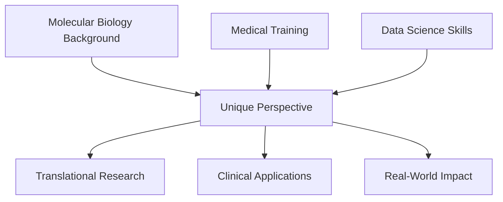

#   Cholpon Zhakshylykova | Data Scientist with Bioinformatics Expertise  

  

---

##   About Me

I’m a data scientist with a strong background in molecular biology and bioinformatics.  
I specialize in applying **machine learning, deep learning, and statistical analysis** to biological, clinical, and real-world datasets.  
My mission: **transform complex data into actionable insights** in healthcare, science, and beyond.  

💡 Highlights:  
- 3+ years as a **Research Scientist** (NGS, genomics, clinical data)  
- Hands-on with **Python, SQL, ML, deep learning, and data visualization**  
- Experience deploying **interactive ML apps** with Streamlit  
- Passion for bridging **biology + AI** for real-world impact

##  Featured Projects  
- **🧠 MedAI Literature Explorer** | AI-powered tool for scientific literature. Upload PDFs/URLs, ask questions (Q&A) and generate summaries using LLMs + semantic search → [Repo](https://github.com/CZhakshylykova/MedAI-Literature-Explorer)

  *Python · Streamlit · LangChain · FAISS · OpenAI GPT*
- **🫁 Pneumonia Detection from X-Rays** | CNN model for pneumonia classification with Grad-CAM explainability → [Repo](https://github.com/CZhakshylykova/SDS-CP021-pneumonia-detection/tree/main/submissions-team/cholpon-zhakshylykova)  

  *Python · PyTorch · Streamlit*  

- **❤️ Heart Failure Prediction** | Clinical outcome prediction using ML with SHAP explainability → [Repo](https://github.com/CZhakshylykova/Heart-Attack-Risk)  

  *Python · scikit-learn · SHAP*  
- **🎓 EduSpend Analytics** | Predicted global education costs and built an interactive Streamlit dashboard → [Live Demo](https://edu-spends.streamlit.app/)  

  *Python · scikit-learn · Streamlit*  
- **⚡ PowerCast (In Progress)** | Forecasting electricity demand from weather data using time-series ML → [Repo](https://github.com/CZhakshylykova/SDS-CP036-powercast)  

  *Python · XGBoost · LSTM*  

### **Core Technologies**

  <!-- Core Language -->
  
  
  <!-- LLM & AI -->
  
  
  
  
  
  <!-- Machine Learning & DS -->
  
  
  
  
  
  <!-- Data Handling -->
  
  
  
  <!-- Visualization -->
  
  
  
  
  <!-- App & Deployment -->
  
  
  
  

---

## 🌟 What Sets Me Apart

---

## 🤝 Let's Connect & Collaborate

I'm always excited to discuss:
- **Research collaborations** in medical AI
- **Data science projects** with biological applications
- **Clinical ML** implementations
- **Career opportunities** in computational biology

  

---

  <i>🧬 "In the intersection of biology and data science, we find the future of medicine" 🧬</i>

  <i>"Turning biological and clinical data into actionable insights with Data Science & AI"</i>

