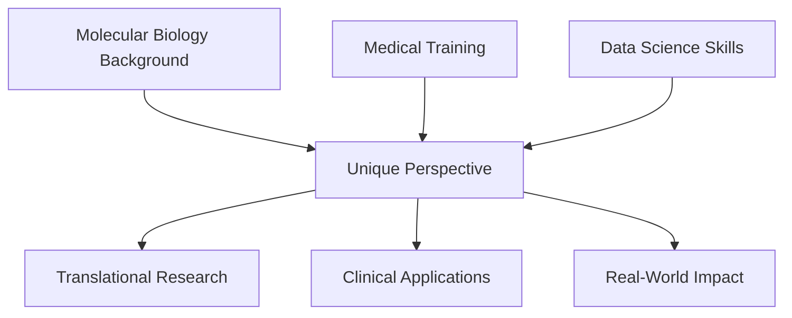

#   Cholpon Zhakshylykova | Where Biology Meets Data

<div align="center">
  
</div>

---

##   About Me

I'm at the intersection of **molecular biology**, **medicine**, and **data science** — decoding complex biological systems through the lens of computational intelligence. With hands-on lab experience and clinical training, I translate real-world medical challenges into robust data solutions.

```python
class DataDrivenBiologist:
    def __init__(self):
        self.background = ["Molecular Biology", "Medical Student"]
        self.passion = "Data-driven discovery"
        self.superpower = "Bridging wet lab & computational science"
        self.mission = "Transform complex biology → actionable insights"
    
    def current_focus(self):
        return {
            "🧠": "Medical AI & Predictive Modeling",
            "🔬": "Computational Biology",
            "📊": "Clinical Data Analysis",
            "🤖": "MLOps & Experiment Tracking"
        }
```

---

##   Featured Projects

###  SpineScope: Orthopedic Patient Classification
> **Clinical AI Pipeline** | *Advanced ML with Real-World Impact*

<details>
<summary><b>🔍 Deep Dive</b></summary>

**The Challenge:** Accurately classify orthopedic patients as "Abnormal" or "Normal" using clinical biomechanical data.

**My Solution:**
- 🔧 **Data Engineering**: Sophisticated preprocessing with SMOTE for class balancing
- 🧠 **Neural Architecture**: Custom PyTorch models with hyperparameter optimization
- 📊 **MLOps**: End-to-end experiment tracking with MLflow
- 📈 **Results**: Achieved high accuracy with robust cross-validation

**Tech Stack:** `Python` `PyTorch` `MLflow` `SMOTE` `pandas` `scikit-learn`

**Impact:** Demonstrates production-ready ML pipeline for clinical decision support

[🔗 **Explore Repository**](https://github.com/SuperDataScience-Community-Projects/SDS-CP033-spinescope/tree/main/submissions/team-members/cholpon-zhakshylykova)

</details>

---

###   CardioPredict: Heart Attack Risk Assessment
> **Interpretable Medical AI** | *Transparent Predictions for Clinical Use*

<details>
<summary><b>🔍 Deep Dive</b></summary>

**The Challenge:** Build interpretable models for predicting cardiovascular risk in patients.

**My Solution:**
- 🎯 **Model Development**: Custom risk prediction algorithms with clinical validation
- 🔍 **Interpretability**: SHAP values and feature importance for clinical transparency
- 📋 **Communication**: Clear risk visualization for both clinicians and patients
- 🏥 **Clinical Focus**: Designed with real-world medical workflow in mind

**Tech Stack:** `Python` `scikit-learn` `PyTorch` `SHAP` `pandas` `matplotlib`

**Impact:** Provides explainable AI for critical medical decisions

[🔗 **Explore Repository**](https://github.com/CZhakshylykova/Heart-Attack-Risk)

</details>

---

###   EduSpend Analytics: Government Education Investment Predictor
> **Policy Analytics Dashboard** | *Interactive Data Science for Public Good*

<details>
<summary><b>🔍 Deep Dive</b></summary>

**The Challenge:** Analyze education spending patterns and predict future government investment trends.

**My Solution:**
- 📊 **Data Analysis**: Comprehensive EDA revealing key spending drivers
- 🔮 **Predictive Modeling**: Regression models for spending forecasts
- 🌐 **Interactive Dashboard**: Live Streamlit app for stakeholder exploration
- 📈 **Actionable Insights**: Clear recommendations for policy makers

**Tech Stack:** `Python` `Streamlit` `pandas` `scikit-learn` `matplotlib` `seaborn`

**Impact:** Empowers data-driven education policy decisions

[🌐 **Live Dashboard**](https://edu-spends.streamlit.app/) | [🔗 **Repository**](https://github.com/CZhakshylykova/SDS-CP030-edu-spend/tree/main/submissions/team-members/cholpon-zhakshylykova)

</details>

---

### **Core Technologies**
<p align="left">
  
  
  
  
  
  
  
  
  
  
  
  
  
  
</p>

---

## 📊 GitHub Analytics

<div align="center">
  
  
</div>


---

## 🌟 What Sets Me Apart


---

## 🤝 Let's Connect & Collaborate

I'm always excited to discuss:
- **Research collaborations** in medical AI
- **Data science projects** with biological applications
- **Clinical ML** implementations
- **Career opportunities** in computational biology

<div align="center">
  <a href="https://www.linkedin.com/in/cholpon-zhakshylykova">
    
  </a>
</div>

---

<div align="center">
  <i>🧬 "In the intersection of biology and data science, we find the future of medicine" 🧬</i>
</div>

<div align="center">
  
</div>
